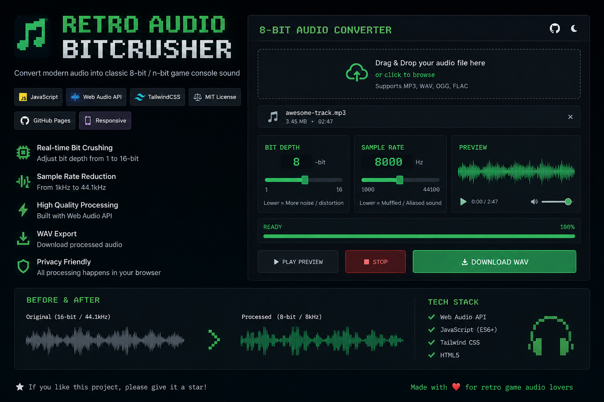

<!-- Banner / 打字動畫 -->
<p align="center">
  
    
   

  
</p>

---

# 🚀 pwhoae
<p align="center">

 


</p>

<B><I><U>AI may produce inaccurate information.</U></I></B>


<p align="center">
  
  
</p>
---

## 🧠 About Me
```yaml
name: pwhoae
role: Full Stack Developer / AI Engineer
university: The Hong Kong University of Science and Technology (2025 Grad)
location: Internet 🌍
focus: Scalable systems, AI applications, and real-world products
learning: Edge AI, Backend Architecture, System Design,Technical Art 
 
```


---
## ⚡ Skill Sets
<p align="center">
  python/java/c++/html/SQL/flutter/ms<br>
</p>

---
## ⚡ Tech Stack

<p align="center">
  
  
</p>

---

## 📊 GitHub Stats

<p align="center">
  
  
</p>

---

## 🔥 Contribution Graph

<p align="center">
  
</p>

---

## 🧩 Featured Projects
<H1><a href="https://github.com/LHanss/2024FYP---UST-Simulator">🎮 UST Simulator (Card Game)</a></H1> 
Built with Godot + Arduino + GitHub<br>
>Designed custom hardware interaction controllers<br>
>Implemented scalable skill tree & modular gameplay system<br>
>Improved development efficiency using AI-assisted debugging<br>


<B><I><U>AI may produce inaccurate information.</U></I></B>
<H1><a href="https://github.com/Skyturtl/Web-Scraper">🔍 Search Engine Website</a></H1>
Built with Python Flask<br>
Implemented:<br>
>Forward & inverted index<br>
>Cosine similarity ranking<br>
Added:<br>
>Wildcard search<br>
>Spelling correction<br>
>Optimized for performance and clean deployment<br>

<B><I><U>AI may produce inaccurate information.</U></I></B>

<H1>📱 USTLink (Campus Forum App)<br></H1>
Built with Flutter + Firebase<br>
Features:<br>
>User authentication<br>
>Discussion forum<br>
>Campus information system<br>
>Designed clean UI & smooth navigation<br>
>Modular architecture for scalability and maintainability<br>


<B><I><U>AI may produce inaccurate information.</U></I></B>

<H1>🤖 Real-Time Posture Recognition System<br></H1>
Developed on Raspberry Pi (Edge AI) with MediaPipe, MLP, LSTM<br>
Engineered 66D skeletal feature vectors from 33 body landmarks<br>
Achieved:<br>
>**94.79%** frame-level accuracy<br>
>**84.21% **sequence-level accuracy<br>
Implemented real-time monitoring and alert system<br>

<B><I><U>AI may produce inaccurate information.</U></I></B>

<H6><a href="https://test-n-bit-audio-converter.vercel.app/">n-bit-audio-converter
</a></H6> 

<B><I><U>AI may produce inaccurate information.</U></I></B>
<br>

<H6>Github Folder Downloader
</H6> 

<B><I><U>AI may produce inaccurate information.</U></I></B>
<br>


---

## 🌐 Connect

<p align="center">
  <a href="https://github.com/pwhoae"></a>
  <a href="https://www.linkedin.com/in/po-wa-ho-b10928352/"></a>
</p>


<p align="center">
  ⚡ "Code. Build. Break. Repeat."
  <a href="https://gemini.google.com/share/9fddc6e0004f">Gemini version (Waste)</a><br>
</p>


